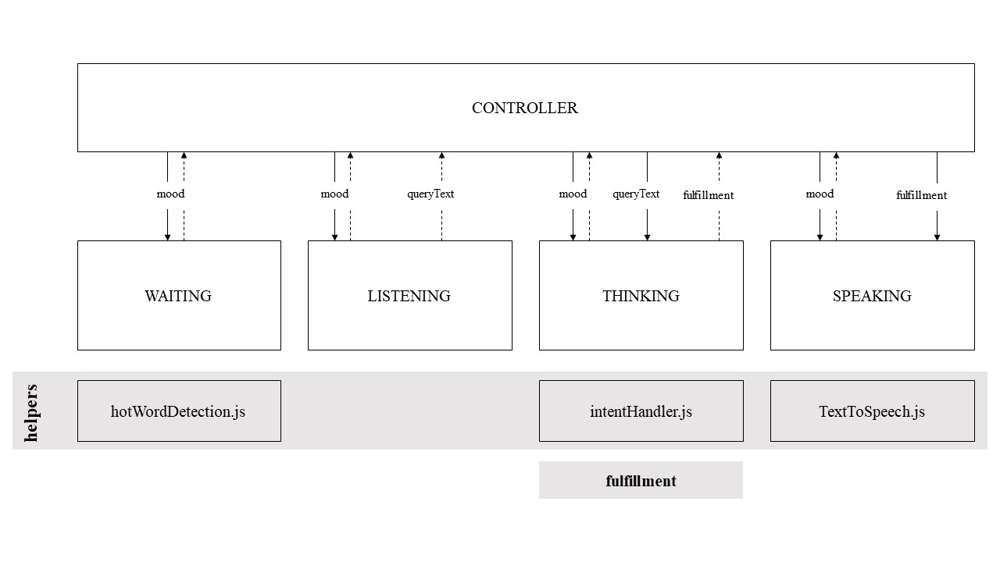
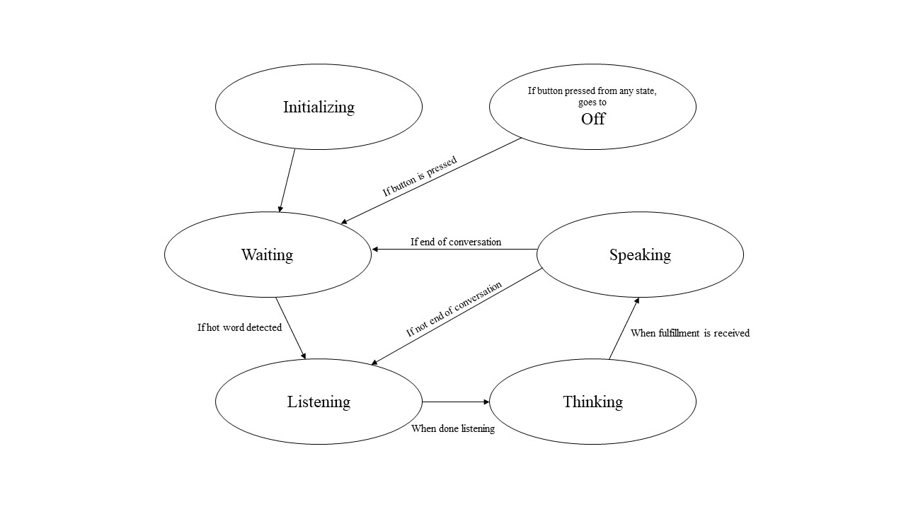

# In Browser Voice Assistant!

If you want a custom Alexa-esque voice assistant, but in your browser, you got it! Why would you need a voice assistant in your browser, you may ask? This voice assistant can be accessed from anywhere - your phone, your laptop, just by going to the hosted URL. Link it to your Dialogflow agent and you're all set!


## Rough Architecture


above is the rough architecture of the in browser voice assistant.



above are the state transitions allowed in this application

## Directory Breakdown

| DIRECTORY NAME | DESCRIPTION |
|----|----|
|containers| includes all react UI components that make up the front end|
|moods| the logic of this application - includes the logic of the 4 different moods|
|helpers| helper scripts that the moods use. Includes hotword detection and the mainIntentHandler|
|fulfillment| Includes the different fulfillment handlers that handle fulfillments locally. All these will be imported in the mainIntentHandler (found in helper)|
|assets| static items that might be used. Now it only includes a default fulfillment speech wav file. Not useful at the moment|
|utils| utilities|

## Built With
download everything that is needed with
```
npm install
```

to make HTTP requests:
* request
* request-promise
* axios

<i> *it would be good if we could cut the number of libraries we rely on here to 1 </i>


to build HTTP requests:
* xml-builder

To support front end stuff:
* d3-ease
* d3-interpolate
* react-move
* @material-ui
* firebase
* moment

To support back end stuff:
* porcupine hot word detector
* web speech API
* google cloud functions
* dialogflow
* blobs
* web audio API

## How Do I Run It?

Just like how you would do with any react app!
```
npm start
```
## Creating Fulfillment Handlers
your fulfillment handler's return should be one of two things:

1. a fulfillment string
2. a fulfillment array that consists of [fulfillmentText, name, showRecentSightings, showTickerTape]

## Adding Fulfillment Handlers
1. Create the fulfillment handler in the "fulfillment" folder
2. export your fulfillment handler function
3. import your fulfillment handler in "helpers/intentHandler.js"
4. Add your fulfillment handler to the intentMap
5. yay!

## FUTURE TO-DOs
1. allow change in language
2. do all initialization stuff in initializing state
3. refactor thinking and speaking to one component
4. use only request-promise or axios
5. handle the CORS thing, stop using the heroku app quick fix
6. Create debug mode
7. create separate sessions
